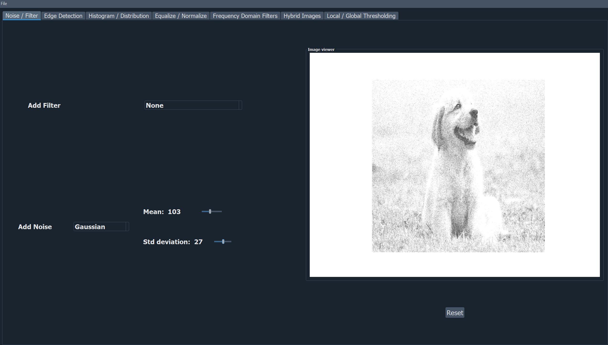
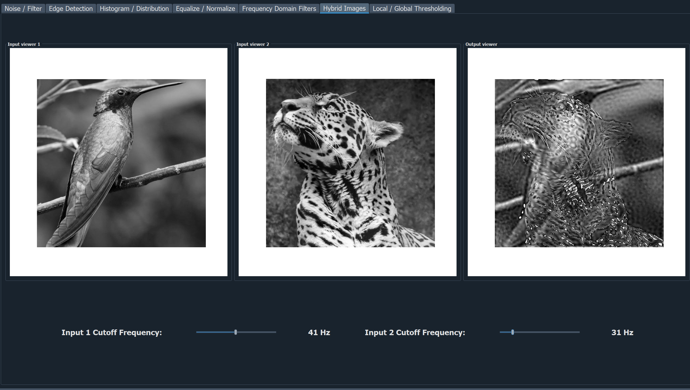
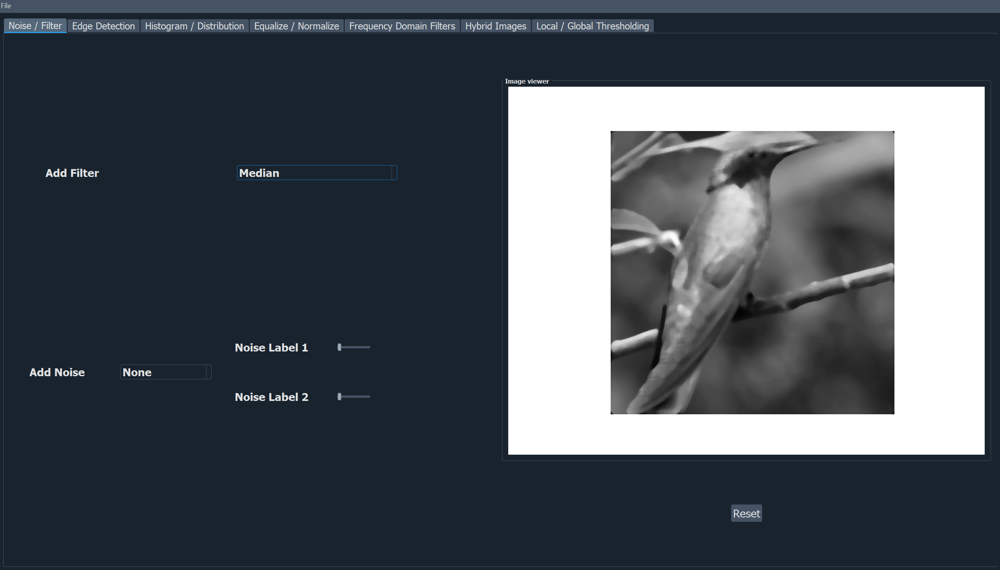

# VisualFX Studio: Your Ultimate Image Enhancement Suite

## Introduction

This project is an image processing application developed using PyQt5 in Python. The application provides various functionalities for image manipulation, including adding noise, filtering, edge detection, histogram analysis, equalization, normalization, thresholding, frequency domain filtering, and creating hybrid images.

## Screenshots






## Requirements

- Python 3.x
- OpenCV library (`opencv-python` package)
- PyQt5 library (`pyqt5` package)
- Matplotlib library (`matplotlib` package)
- Numpy library (`numpy` package)

## Instructions

1. Clone or download the project repository.
2. Install the required dependencies using pip:
   ```
   pip install opencv-python pyqt5 matplotlib numpy
   ```
3. Run the main Python script to launch the application.
4. Use the GUI to load images, perform various image processing tasks, and visualize the results.
5. Follow the instructions provided in the GUI or tooltips to interact with different features.

## Features

1. **Load Images**

   - Load RGB and grayscale images using the application.

2. **Additive Noise**

   - Add various types of noise (Uniform, Gaussian, Salt & Pepper) to the images.

3. **Filtering Noisy Images**

   - Apply low-pass filters (Average, Gaussian, Median) to filter noisy images.

4. **Edge Detection**

   - Detect edges using different masks (Sobel, Roberts, Prewitt, Canny).

5. **Histogram Analysis**

   - Draw histograms and distribution curves of images.

6. **Image Equalization**

   - Perform histogram equalization on images.

7. **Image Normalization**

   - Normalize the intensity values of images.

8. **Color to Gray Conversion**

   - Convert color images to grayscale and plot RGB histograms with distribution functions.

9. **Thresholding**

   - Apply local and global thresholding methods.

10. **Frequency Domain Filters**

    - Apply high-pass and low-pass filters in the frequency domain.

11. **Hybrid Images**
    - Create hybrid images using Fourier transforms.

## Contributors

- Mohamed Sayed Mosilhe
- Mina Adel
- Mariam Magdy
- Ali Maged
- Abdallah Ahmed
